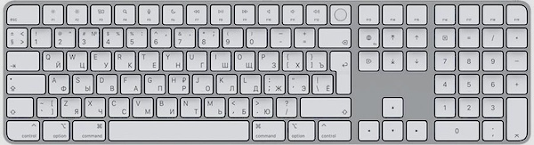

# Бэкграунд

С 1998 по 2024 я пользовался так называемой "стандартной" клавиатурой.
С 2011 на постоянной основе, когда стал программистом.
Примечательно, что за эти годы я так и не освоил навык слепой десятипальцевой печати.
Клавиатура всегда была самой простой, единственное требование - это двухэтажный пробел.

# Начало

В 2023 году я озаботился эргономикой и эстетикой рабочего места. Мне захотелось хорошую мышь и клавиатуру. С мышами оказалось все довольно просто: выбрать точную и удобную легко. После изучения обзоров и перебором методом купли-продажи на 4-м варианте был найден идеал Logitech MX Master 3S. А вот с клавиатурами я застрял. Застрял всерьез и надолго.

Все началось с разглядывания модных сетапов в инстаграме. Интерес возбуждала эстетика механических клавиатур. Начал я с низкопрофильных версий